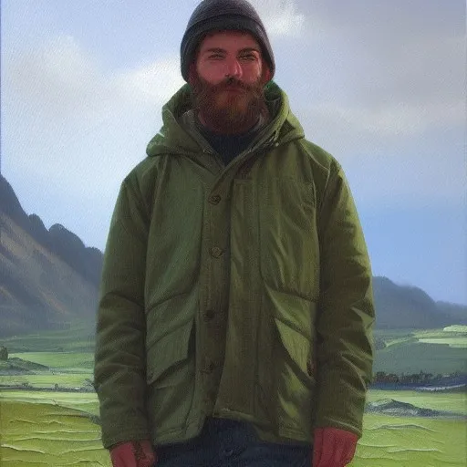
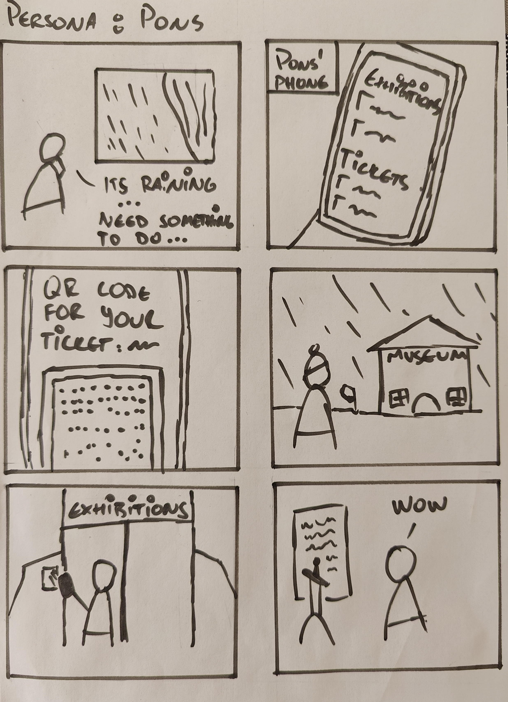

---
geometry: margin=1in
fontsize: 12pt
urlcolor: blue
header-includes: |
    \usepackage[scaled]{beramono}
    \usepackage{setspace}\doublespacing
    \usepackage{float}
    \usepackage{graphicx}
    \usepackage{graphbox}
    \usepackage[export]{adjustbox}
    \pagenumbering{gobble}
title: |
  | \vspace{3cm} \large TÖL502M - Human Computer Interaction 
  | \vspace{0.2cm} \Huge Project Ei2 - Personas and storyboard 
author: |
  | Student: Jaan Jaerving \vspace{0.2cm} 
  | Email: jaj20@hi.is \vspace{8cm}
date: \small \today
...

\pagebreak
\pagenumbering{arabic}

# Challenge from Ei1

The project chosen for the previous assignment was:

*c) View an exhibition at the National Museum of Iceland*

\pagebreak

\singlespacing

# Pons Paternoster

{width=40%}

## Facts:

* 28 years old
* Lives in Nice, France
* Works as an estate agent
* Lives with 3 roommates

## Behaviors

* Tries to travel at every opportunity
* Enjoys the outdoors
* Follows multiple travel influencers on Instagram
* Likes to try out different cultural cuisines

## Needs & Goals

* Visit 30 countries before his 30th birthday
* Find new life experience opportunities at a low cost
* Discover new recipes to try
* Meet new people

\pagebreak

# John A. Beller

{width=40%}

## Facts:

* 49 years old
* Lives in Boston, Massachusetts
* Works as a physician
* Single father
* Lives in an upscale apartment with his daughter

## Behaviors

* Doesn't have a lot of free time
* Pays for house cleaning and meal services
* Gets vacation package deals and tour offers sent to him via e-mail

## Needs & Goals

* Time to spend with his daughter
* New experiences to broaden his daughters horizons
* Have a well structured and productive daily schedule with minimal waste

\pagebreak

# Alda Björk Jónsdóttir

{width=40%}

## Facts:

* 79 years old
* Lives in Reykjavík, Iceland 
* Retired, former Librarian
* Several grandchildren
* Lives in her own house in the 101 district

## Behaviors

* Has a lot of free time
* Enjoys reading about history & archaeology
* Often goes to PhD thesis defense events at the local university
* Not very tech savvy but recently received an iPad as a gift

## Needs & Goals

* Find ways to spend time with her grandchildren
* Stay up to date with current events and findings
* Opportunities to get out of the house

# Storyboard

{ width=99% }

\pagebreak

# Summary

This exercise helped put some additional thought into the target groups who are likely to visit exhibitions at the museum. This brings with it some additional thoughts. Someone like Pons who is effectively a stand-in for many of the younger tourists who visit Iceland for the various outdoor sights would likely not prioritize the museum and is likely to pick it as a fallback, which was the beginning setting of the storyboard on the previous page. If the intention were to target this group more it becomes important to ensure that the museum has sufficient exposure on social media and is also cost competitive with alternative low-effort indoor activities.

That type of exposure as well as the one-time ticket cost becomes less important when considering people more like John. In his case its more likely that a day in the museum would be part of the planned schedule of a tour group which cuts out the individual level investigation portion of the challenge. This group would likely place some extra strain on the actual mechanics of entry at the museum - ideally then it should be possible for a guide to wave through a pre-registered tour group quickly and easily. It is then important to consider that the mechanics of entering the exhibition area work for both large groups as well as individuals. 

The final perspective that is likely worth keeping in mind is locals like Alda. They are more likely to know the museum exists already but would be more interested to see information about new temporary exhibitions whereas for tourists it is likely that they will only ever visit the museum once and will therefore be fine visiting the permanent Icelandic history exhibition. Here it would be useful to continue and further examine the value propositions of the different tickets and how those tickets compete with activities that could potentially be competing with going to a museum exhibition. A year long access ticket might be of value to locals as long as new temporary exhibitions cycle in and out frequently enough but Pons would still be forced to buy this ticket for a single visit, and this might make the museum a less attractive option for him.
