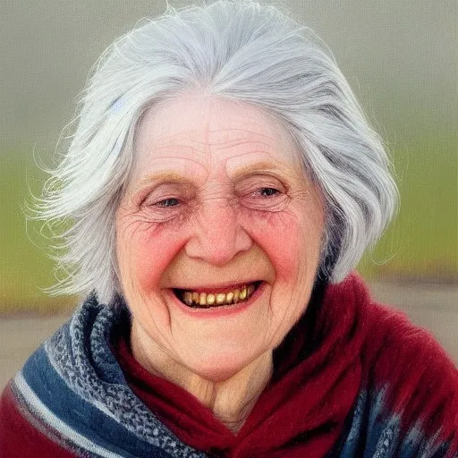

---
geometry: margin=1in
fontsize: 12pt
urlcolor: blue
header-includes: |
    \usepackage[scaled]{beramono}
    \usepackage{setspace}\doublespacing
    \usepackage{float}
    \usepackage{graphicx}
    \usepackage{graphbox}
    \usepackage[export]{adjustbox}
    \pagenumbering{gobble}
title: |
  | \vspace{3cm} \large TÖL502M - Human Computer Interaction 
  | \vspace{0.2cm} \Huge Project Ei2 - Personas and storyboard 
author: |
  | Student: Jaan Jaerving \vspace{0.2cm} 
  | Email: jaj20@hi.is \vspace{8cm}
date: \small \today
...

\pagebreak
\pagenumbering{arabic}

# Challenge from Ei1

The project chosen for the previous assignment was:

*c) View an exhibition at the National Museum of Iceland*

\pagebreak

\singlespacing

# Pons Paternoster

{width=40%}

## Facts:

* 28 years old
* Lives in Nice, France
* Works as an estate agent
* Lives with 3 roommates

## Behaviors

* Tries to travel at every opportunity
* Enjoys the outdoors
* Follows multiple travel influencers on Instagram
* Likes to try out different cultural cuisines

## Needs & Goals

* Visit 30 countries before his 30th birthday
* Find new life experience opportunities at a low cost
* Discover new recipes to try
* Meet new people

\pagebreak

# John A. Beller

{width=40%}

## Facts:

* 49 years old
* Lives in Boston, Massachusetts
* Works as a physician
* Single father
* Lives in an upscale apartment with his daughter

## Behaviors

* Doesn't have a lot of free time
* Pays for house cleaning and meal services
* Gets vacation package deals and tour offers sent to him via e-mail

## Needs & Goals

* Time to spend with his daughter
* New experiences to broaden his daughters horizons
* Have a well structured and productive daily schedule with minimal waste

\pagebreak

# Alda Björk Jónsdóttir

{width=40%}

## Facts:

* 79 years old
* Lives in Reykjavík, Iceland 
* Retired, former Librarian
* Several grandchildren
* Lives in her own house in the 101 district

## Behaviors

* Has a lot of free time
* Enjoys reading about history & archaeology
* Often goes to PhD thesis defense events at the local university
* Not very tech savvy but recently received an iPad as a gift

## Needs & Goals

* Find ways to spend time with her grandchildren
* Stay up to date with current events and findings
* Opportunities to get out of the house

\pagebreak

# Storyboard

\pagebreak

# Summary
